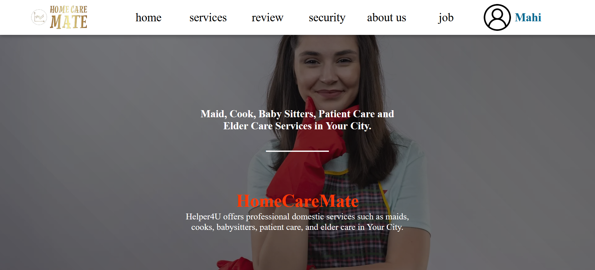

# HomeCarMent  

**Open In Live : 🔗 https://homecaremate.onrender.com/** 

Welcome to **HomeCarMent**, your trusted online platform connecting households with reliable domestic help. Just like Kamvali, we understand the importance of finding skilled and trustworthy assistance for your home. Helper4U simplifies the hiring process, offering a seamless experience for both employers and job seekers. Explore our comprehensive database of verified professionals, whether you're seeking domestic helpers, caregivers, or other household services. With Helper4U, discover the right match for your needs, ensuring a secure and efficient solution for all your domestic staffing requirements.

## Why Use HomeCarMent 
<ul>
<li> <h5>Verified Professionals:</h5>  Helper takes the hassle out of hiring by providing a platform with verified and background-checked domestic helpers. Trust and reliability are at the core of our service.
 </li>

 <li> <h5>Comprehensive Database: </h5>  Explore a diverse and extensive database of skilled professionals, including domestic helpers, caregivers, and other household service providers. Helper4U offers a wide range of options to cater to your specific needs.
 </li>

 <li> <h5>Simplified Hiring Process:</h5>  Our user-friendly platform streamlines the hiring process, making it easy for both employers and job seekers. Say goodbye to the complexities of finding the right domestic help.
 </li>

 <li> <h5>Secure and Transparent:</h5> We prioritize your safety and security. Helper4U ensures a transparent hiring process, with clear information on candidates and a commitment to protecting your privacy.
 </li>

 <li> <h5>Efficient Matchmaking: </h5> Save time and effort with our efficient matchmaking system. Helper4U connects you with professionals who align with your requirements, ensuring a successful and satisfying hiring experience.
 </li>

 <li> <h5>Supportive Community:</h5> Join a supportive community of employers and job seekers. Helper4U fosters a positive environment, encouraging open communication and collaboration.
 </li>

</ul>

# Contributors

<!-- Made with [contrib.rocks](https://contrib.rocks). -->